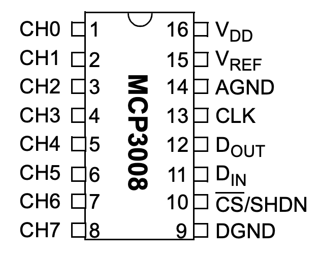
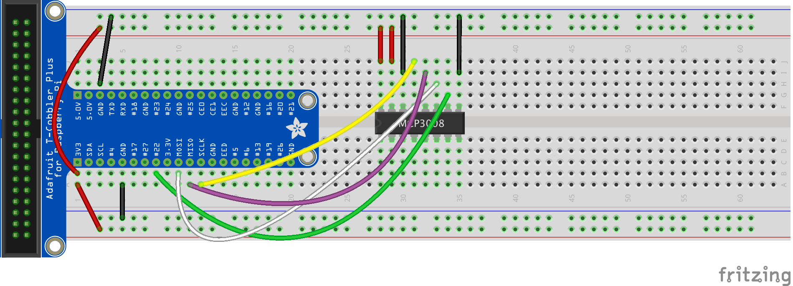
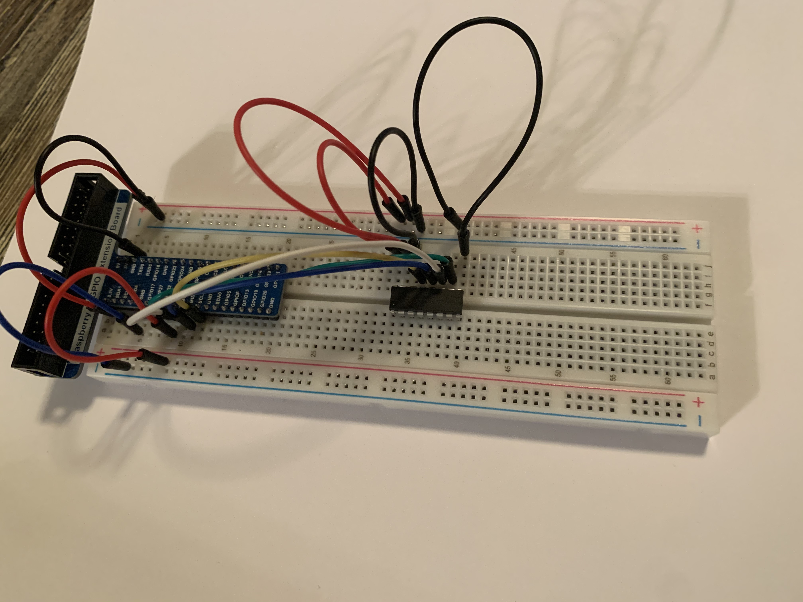
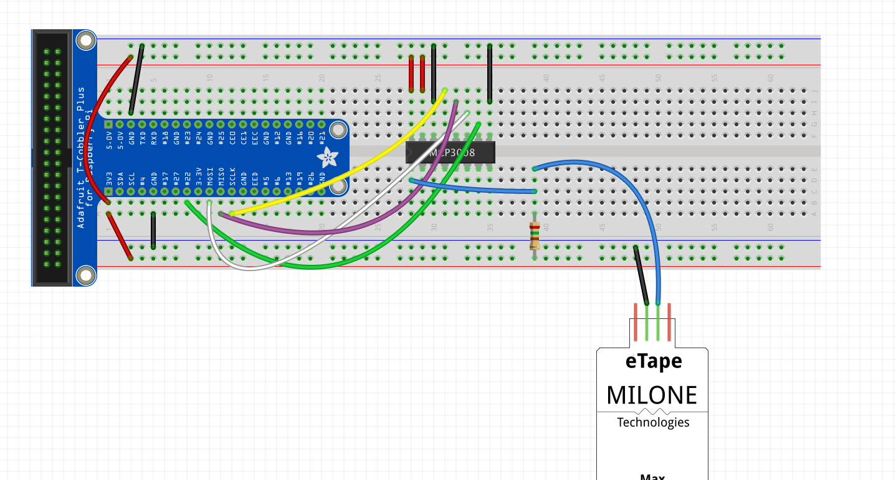
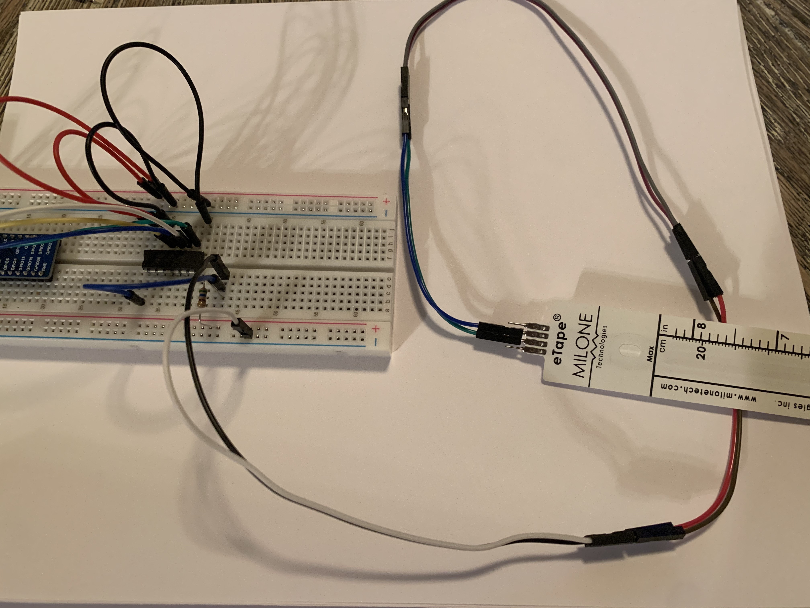

# Stage 1: Print water level on screen using raspberry pi and eTape sensor

Directions borrowed heavily from  
https://learn.adafruit.com/reading-a-analog-in-and-controlling-audio-volume-with-the-raspberry-pi/connecting-the-cobbler-to-a-mcp3008

# To get started
We will need the following:
- Raspberry pi 4
- 8in eTape
https://www.adafruit.com/product/463
- MCP3008 ADC (or similar)
https://www.adafruit.com/product/856
- Adafruit T-cobbler
https://www.adafruit.com/product/2028
- Fullsize breadboard
https://www.adafruit.com/product/239
- Breadboarding wires (male-male & male-female)
https://www.adafruit.com/category/82

# Wiring

### Why we need an ADC
The Raspberry Pi computer does not have a way to read analog inputs. It's a digital-only computer. 
Analog inputs are handy because many sensors are analog outputs, so we need a way to make the Pi analog-friendly.

We'll do that by wiring up an MCP3008 chip to it. 
The MCP3008 acts like a "bridge" between digital and analog. 
It has 8 analog inputs and the Pi can query it using 4 digital pins. 
That makes it a perfect addition to the Pi for integrating simple sensors like photocells, FSRs or potentiometers, thermistors, etc.!

### MCP3008 wiring

Let's check the datasheet of the MCP3008 chip.
On the first page in the lower right corner there's a pinout diagram showing the names of the pins:
 
 

In order to read analog data we need to use the following pins:

VDD (power) and DGND (digital ground) to power the MCP3008 chip. We also need four "SPI" data pins: DOUT (Data Out from MCP3008), CLK (Clock pin), DIN (Data In from Raspberry Pi),  and /CS (Chip Select). 

The MCP3008 has a few more pins we need to connect: AGND (analog ground, used sometimes in precision circuitry, which this is not) connects to GND, and VREF (analog voltage reference, used for changing the "scale" - we want the full scale, so tie it to 3.3V).

Below is a wiring diagram. Connect the 3.3V cobbler pin to the left + rail and the GND pin to the right - rail. Connect the following pins for the MCP chip

MCP3008 VDD -> 3.3V (red)  
MCP3008 VREF -> 3.3V (red)  
MCP3008 AGND -> GND (black)  
MCP3008 CLK -> SCLK (yellow)  
MCP3008 DOUT -> MISO (purple)  
MCP3008 DIN -> MOSI (white)  
MCP3008 CS -> #22 (green)  
MCP3008 DGND -> GND (black)  




### Water level sensor wiring
Next, we will connect the eTape water level sensor. The eTape sensor has 4 pins, but we will only be using the middle two. 

The eTape sensor's envelope is compressed by hydrostatic pressure of the fluid in which it is immersed resulting in a change in resistance which corresponds to the distance from the top of the sensor to the fluid surface. The eTape sensor provides a resistive output that is inversely proportional to the level of the liquid: the lower the liquid level, the higher the output resistance; the higher the liquid level, the lower the output resistance. We will measure the resulting voltage drop with the MCP3008.

The water level sensor comes with a 560 ohm resistor, and a 4 pin connector. Put aside the 4 pin connector for now. That will be useful when we solder components to create a more permanent system.




Note that several female-male wires are connected together to create an extension.

# Installing required packages

Assuming a new raspberry pi:

First, enable SPI by following the directions in the link below  
https://learn.adafruit.com/adafruits-raspberry-pi-lesson-4-gpio-setup/configuring-spi

In terminal, copy and paste the following commands  
https://magpi.raspberrypi.org/articles/terminal-help

`sudo apt-get update -y`  
`sudo apt-get upgrade -y`  
(This step will take a while)

Create a "Code" folder on the raspberry  
`mkdir Code`

Change directory into the newly created Code folder  
`cd Code`

Clone repository  
`git clone https://github.com/a-e-e/StillWatersAquariumPi.git`

Change directory into newly cloned repository  
`cd StillWatersAquariumPi`

Install dependencies. 
`pip3 install -r requirements.txt`

# Running code

- Open Thornny Python IDE
- Load -> Code/StillWatersAquariumPi/stage_1/print_water_level.py
- Click 'Run'


# Calibration
- Get etape and out it at 2 in note down the voltage then bring the etape up to 6 in and do the same thing.
- Input voltage in lines 9 & 10 of print_water_level.py under `VOLTAGE_AT_2_INCH` and `VOLTAGE_AT_6_INCH`


# Troubleshooting
```
Traceback (most recent call last):
  File "<stdin>", line 1, in <module>
AttributeError: module 'board' has no attribute 'SCK'
```
- A wrong 'board' package has been installed. Force a reinstall of Blinka library.
```pip3 install --upgrade --force-reinstall adafruit-blinka Adafruit-PlatformDetect```

 
