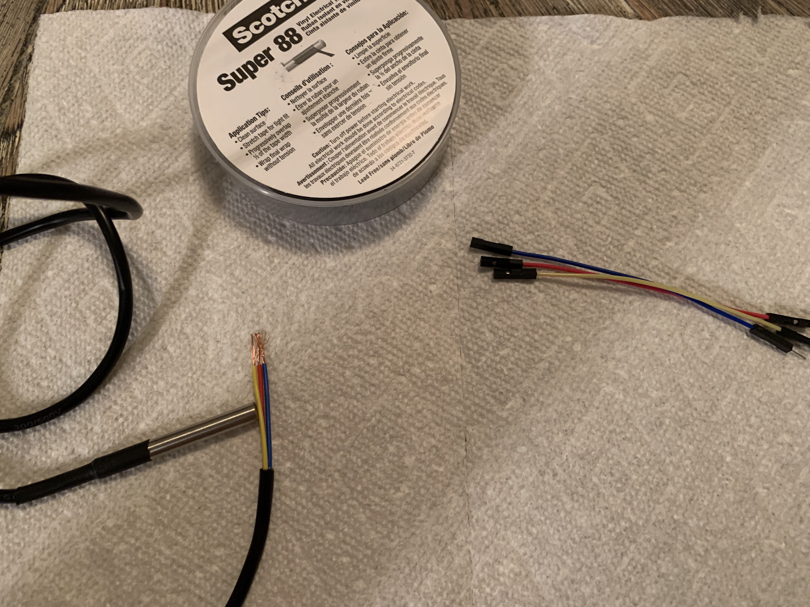
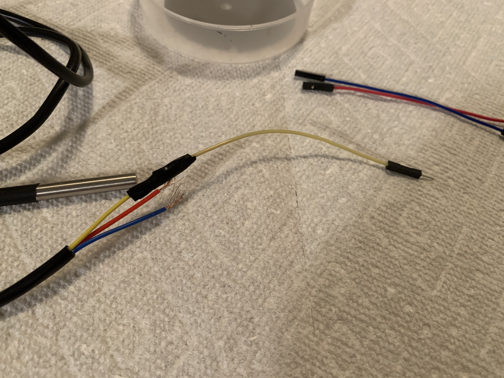
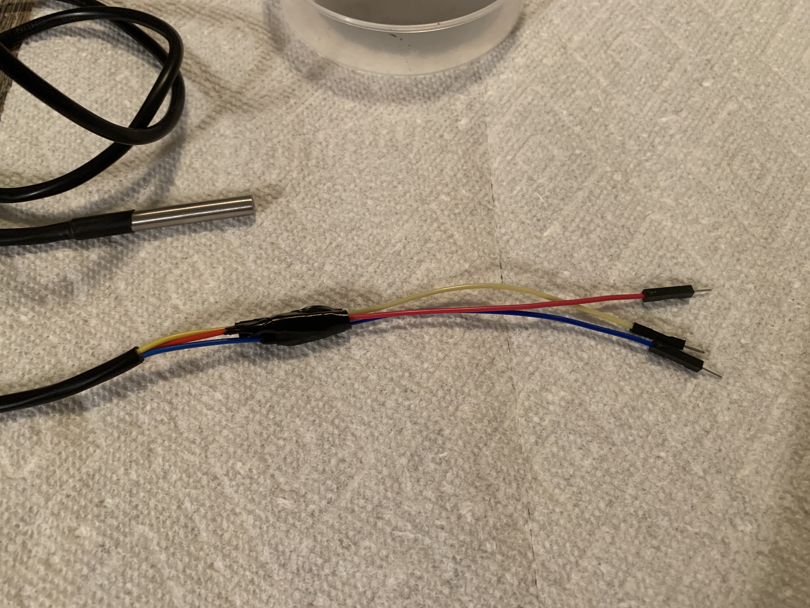
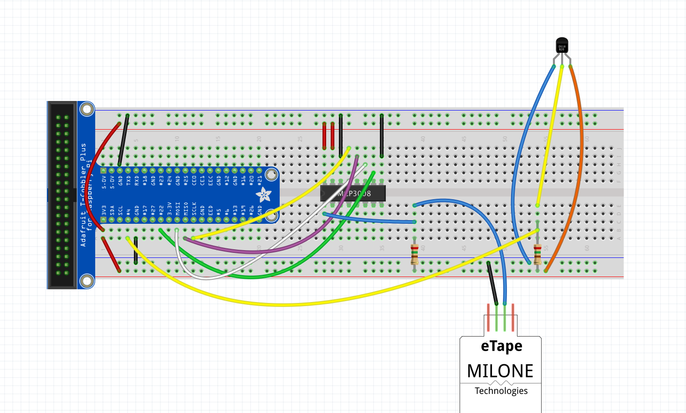
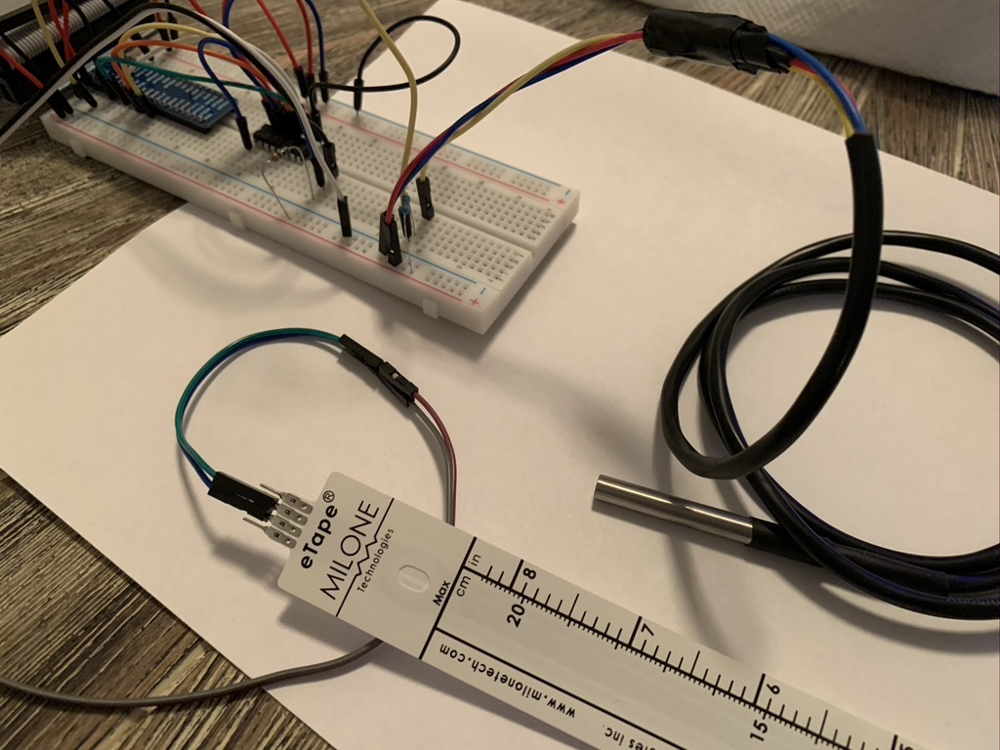
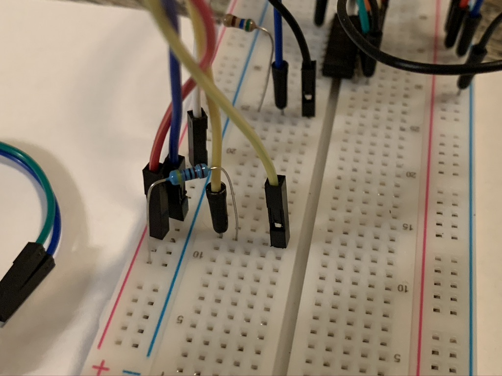

# Stage 2: Print water temperature on screen using raspberry pi and DS18B20 temperature sensor

Referencing https://docs.micropython.org/en/latest/esp8266/tutorial/onewire.html
https://bigl.es/ds18b20-temperature-sensor-with-python-raspberry-pi/

# To get started
Stage 2 builds on the breadboard created from stage 1.

We will need the following:
- Everything from stage 1
- DS18B20 Waterproof temperature sensor
- 4.7k ohm resistor (included with temperature sensor)
- Electrical Tape
https://www.adafruit.com/product/381

## Enable 1 wire interface
https://www.raspberrypi-spy.co.uk/2018/02/enable-1-wire-interface-raspberry-pi/

Unlike the analog water level sensor, the DS18B20 has a built in Analog to Digital converter, featuring a Dallas 1-wire connection. This allows us to skip the MCP3008 ADC required for the water level sensor.

## Install required library
- `sudo pip3 install w1thermsensor`

# Wiring
The temperature sensor has 3 wires: Blue (GND), Orange (3.3V), Yellow (Data).
- Find matching color male to female wires. They will be used to create breadboard friendly connectors for the sensors exposed wires.
- Carefully insert the copper threads into the wires and use electrical tape to secure.

- Connect the blue wire to GND.  
- Connect the red wire to 3.3V.  
- Connect a breadboard row with the yellow wire and GPIO 4.  
- Connect the 4.7k ohm resistor to the above breadboard row and 3.3V. This is called a pull up resistor and is used to ensure that the data pin is always on.  

# Running code

- Open Thornny Python IDE
- Load -> Code/StillWatersAquariumPi/stage_2/print_water_level_and_temperature.py
- Click 'Run'
